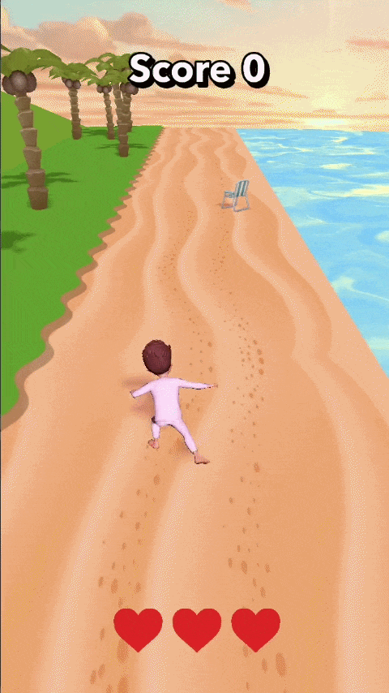
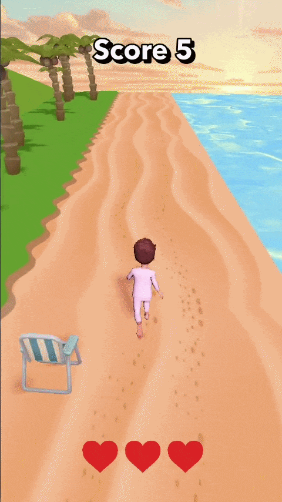

# SplendidScore

An endless runner AR lens for Snapchat built in Lens Studio.



## Gameplay

Tap to start. Your character runs automatically — dodge obstacles and collect stars to build your score. You have **3 lives** shown as hearts in the top corner. Each hit drains one heart and resets difficulty. Lose all three and it's game over.



## Features

- Endless runner with procedural obstacle spawning
- Lives system — 3 hearts displayed on screen
- Score counter
- Difficulty ramp — world speed and obstacle density increase over time
- Camera shake on hit
- Death slowdown transition

## Project Structure

```
Assets/
├── Scripts/
│   ├── Main.js               # Core game loop, lives, score, difficulty
│   ├── AnimationController.js
│   ├── WorldMover.js
│   └── ItemPool.js
└── ...
```

## Setup

1. Open `SplendidScore.esproj` in Lens Studio
2. Assign script inputs in the Inspector on the Main script:
   - **World Mover** — script controlling world scroll speed
   - **Anim Controller** — script controlling character animations
   - **Item Pool** — script managing obstacle/star spawning
   - **Camera** — scene camera for shake effect
   - **Score Text** — UI text component
   - **Heart Images** — array of 3 SceneObjects representing lives (ordered left to right)
